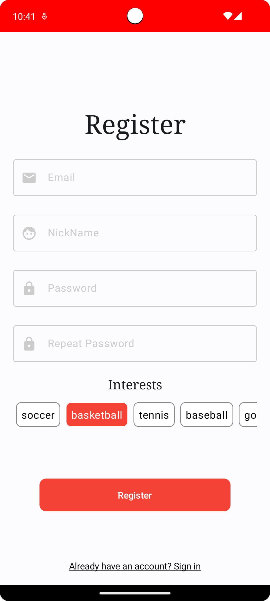

# 🏟️ Sports Court Booking App  

A powerful Android application designed for sports enthusiasts to streamline the process of booking sports courts. Built with Kotlin, Jetpack, Room, and Firebase, this app offers a seamless experience for both competitive athletes and casual players.  



Find the Rest at Screenshots Folder

## 🚀 Features  
- 📅 **Easy Booking**: Quickly reserve courts for your favorite sports.  
- 🔎 **Search & Filter**: Find the perfect court with advanced filters.  
- 🔔 **Notifications**: Get reminders for upcoming bookings.  
- 📊 **Dashboard**: Track your bookings and activities.  

## 🛠️ Tech Stack  
- **Kotlin**: For building a robust and efficient Android app.  
- **Jetpack Components**: Seamless UI and navigation experience.  
- **Room**: Local database for offline support.  
- **Firebase**: Real-time data synchronization and notifications.  

## 📲 Installation  
1. Clone the repository:  
   ```bash  
   git clone https://github.com/yourusername/sports-court-booking-app.git  
